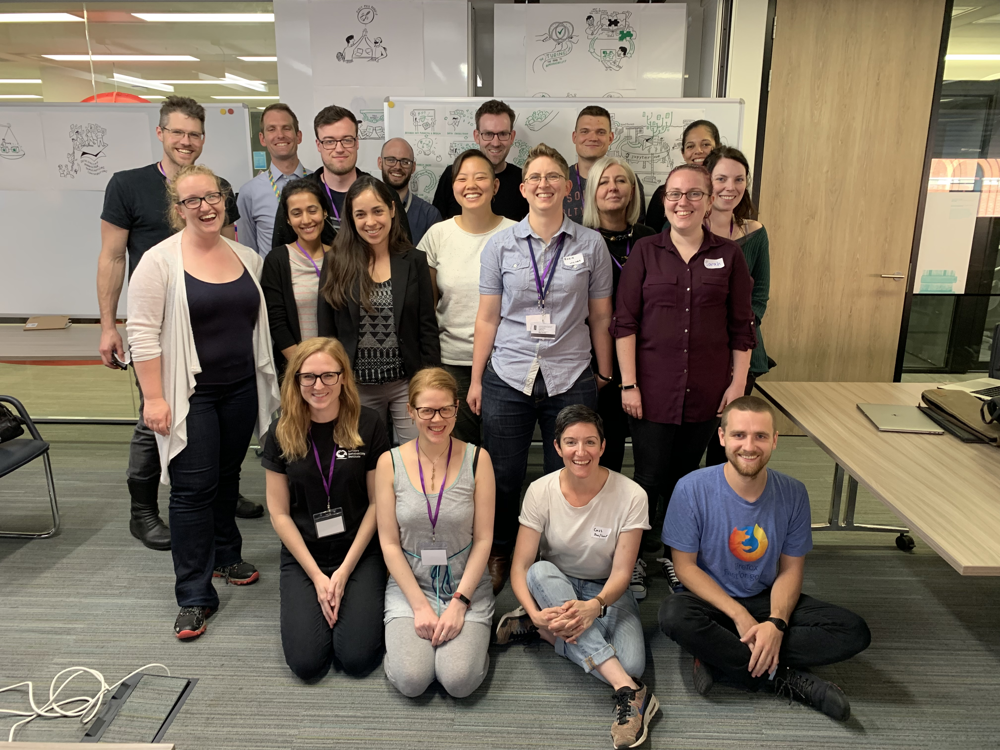
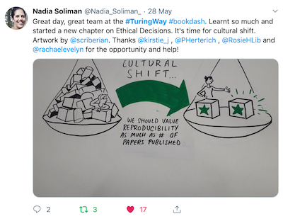
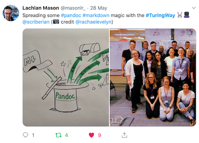

# The Turing Way | Book Dash - London


* Intro to Book Dash MCR slides: https://zenodo.org/record/3233655
* HackMD: http://bit.ly/book-dash-ldn
* Pluses and deltas: https://hackmd.io/qQ8ZjlaYT0qdVIEGzGZjjQ

## The participants


*Back row, left to right: Matthew Kemp, Eric Daub, Michael Grayling, Oscar Giles, Lachlan Mason, Kevin Kunzmann, Nadia Soliman. Middle row, left to right: Kirstie Whitaker, Malvika Sharan, Camila Rangel Smith, Danbee Kim, Rosie Higman, Susanna-Assunta Sansone, Sarah Gibson, Natalei Thurlby. Front row, left to right: Rachael Ainsworth, Patricia Herterich, Cassandra Gould van Praag, Alexander Morley.*

* Rachael Ainsworth [@rainsworth](https://github.com/rainsworth/)
* Eric Daub [@edaub](https://github.com/edaub)
* Sarah Gibson [@sgibson91](https://github.com/sgibson91) 
* Oscar Giles [@OscartGiles](https://github.com/OscartGiles)
* Cassandra Gould van Praag [@cassgvp](https://github.com/cassgvp)
* Michael Grayling [@mjg211](https://github.com/mjg211)
* Patricia Herterich [@pherterich](https://github.com/pherterich)
* Rosie Higman [@rosiehigman](https://github.com/rosiehigman)
* Matthew Kemp [Scriberia](http://www.scriberia.co.uk/)
* Danbee Kim [@taunsquared](https://github.com/taunsquared)
* Kevin Kunzmann [@kkmann](https://github.com/kkmann)
* Eirini Malliaraki [@rockita](https://github.com/rockita)
* Lachlan Mason [@masonlr](https://github.com/masonlr)
* Alexander Morley [@alexmorley](https://github.com/alexmorley)
* Susanna-Assunta Sansone [@SusannaSansone](https://github.com/SusannaSansone) 
* Malvika Sharan [@malvikasharan](https://github.com/malvikasharan)
* Camila Rangel Smith [@crangelsmith](https://github.com/crangelsmith)
* Nadia Soliman [@Nadiasoliman](https://github.com/nadiasoliman)
* Natalei Thurlby [@NatalieThurlby](https://github.com/NatalieThurlby)
* Kirstie Whitaker [@KirstieJane](https://github.com/KirstieJane/)


## Our report

### What did we do?

Our goal for the book dash was to bring together participants enthusiastic about reproducibility to contribute to and improve *The Turing Way* book during a one day collaborative event.
We held a networking event the evening prior to the book dash as a reward and thanks for taking time out to work on the project.
We had an icebreaker for participants to get to know each other and lightning talks where we prompted participants to share unique experiences, expertise or promote any projects that they're working on.
There was a great diversity of lightning talks which were really fun:
* Danbee talked about her science fiction graphic novel that combines her neuroscience PhD research with a speculation on how the next 100 years might play out, given our current intellectual, environmental, and socio-political landscape. Titled *[The First VIRS](http://www.danbeekim.org/VIRS)*, which stands for Vigilante Intergalactic Roustabout Scholar. :art: 
* Sarah brought along some of her cross stitching and discussed how she uses it as a form of self care as she finds it hard to switch off sometimes. She likes that it's methodical work like an ink jet printer, a “glorified form of pixel art”, and that it can get really sassy: “[I’ve got 99 problems but a stitch ain’t one](https://www.goodreads.com/book/show/31947717-i-got-99-problems-but-a-stitch-ain-t-one)”. :tipping_hand_woman: 
* Cassandra told us about her past, present, future. During her PhD, she would swear at her computer because her analysis killed the machine. Colleagues asked her, why aren’t you using High Performance Computing (HPC)? The switch transformed the work she did then and now. She now wants to bring [research software engineering (RSE)](https://researchsoftware.org/) support to everyone. She's applying for funding for 3 postdocs on a fractional basis to establish an RSE department. She wants to know: what kind of work can this newly developed group do to establish themselves? How are we going to measure the success? :woman_technologist:
* Eric revealed that his motivation for contributing to *The Turing Way* was because he spent his PhD simulating earthquakes, running around the beach, brewing beer and cooking in Santa Barbara, but he could more easily reproduce the food and beer he made than any of the science he did. :beers:
* Natalie described the [MAPS](https://jean-golding-institute.github.io/maps/) project: mapping the analytical paths of a crowdsourced data analysis. She wants to know if different types of scientists, researchers and data scientists make different analysis decisions and the goal of this project is to see the variety of different things that can happen and run a data visualisation competition. :world_map:
* Malvika discussed her experience as a community manager in bioinformatics and biology, and that she tries to trick people into thinking open science is great - you won’t need a great reference from a supervisor because everything will be visible! :eyes: 
* Nadia pitcher her citizen science project of 150 scientists over 32 countries, a [systematic review of cannibis models in animals in pain](https://form.jotform.com/90514957489169). There are 10,000+ studies to screen and they are recruiting contributors (who can win an iPad!) to prove that crowd/community/citizen science is actually a feasible thing to do. Her question was, “How to create community to keep people engaged and working on project?” :monkey_face:
* Alex began his talk with, “I always know that my partner is right!” He took a human centred design course, promoting the idea of how to research what you want to build and create things based on what people need which is now really important to how he works now. It involves watching what people are doing, asking what pain points are. He applies this now in the context of open source software and looking to explore user centred design. :man_technologist:


*Networking dinner at Merago hotel.*

During the dash, we set out to build upon the [Collaborations Workshop Hackday experience](https://github.com/alan-turing-institute/the-turing-way/blob/master/workshops/collabw19/hackdayreport_20190403.md): we wanted to enhance the first version of *The Turing Way* book and ensure that contributing to the project is as straightforward as possible.
We had a mixture of contributions including curating and editing existing content, expanding existing content and writing entirely new content.
Specifically:
* 38 new [issues and pull requests](https://github.com/alan-turing-institute/the-turing-way/labels/book-dash-mcr)! (13 issues, 25 pull requests tagged with ```book-dash-mcr```)
* Many of the pull requests have been reviewed, approved and published already, and issues closed!
* Proofreading and editing of existing chapters.
* Further information added to existing chapters.
  * Editing Version control chapter to aid understanding for novice users ([Pull request #500](https://github.com/alan-turing-institute/the-turing-way/pull/500))
  * Generalising the version control chapter so that it includes more background rather than just focusing on git
  * Added a Patient and Public Involvement section under the "Open Scholarship" header ([Issue #497](https://github.com/alan-turing-institute/the-turing-way/issues/497), [Pull request #510](https://github.com/alan-turing-institute/the-turing-way/pull/510))
  * Added content on data organisation in spreadsheets to the RDM chapter, ([Issue #481](https://github.com/alan-turing-institute/the-turing-way/issues/481), [Pull request #499](https://github.com/alan-turing-institute/the-turing-way/pull/499))
* New chapters on:
  * Reproducible data analysis pipelines for machine learning ([Issue #483](https://github.com/alan-turing-institute/the-turing-way/issues/483), [Pull request #477](https://github.com/alan-turing-institute/the-turing-way/pull/477), looking for reviewers)
  * Credit for reproducible research ([Pull request #485](https://github.com/alan-turing-institute/the-turing-way/pull/485), looking for reviewers)
  * Code styling for reproducibility ([Issue #124](https://github.com/alan-turing-institute/the-turing-way/issues/124), [Pull request #498](https://github.com/alan-turing-institute/the-turing-way/pull/498))
* Reviewed pull requests.
* Restructuring of the chapter sections.
* A pull request to Jupyter Book: [Adding search button on Jupyter Book](https://github.com/jupyter/jupyter-book/pull/196)
* Improved the ease of contributing to the project through enhanced pull request/issue templates, organisation of the repo, search functionality and continuous integration within the book.
* Acknowledged contributors! :tada:
* Gorgeous graphics! :heart_eyes:


*Art by Matthew Kemp of [Scriberia](http://www.scriberia.co.uk/). Photo credit: Jez Cope*


## What did we learn?

* 2 first pull requests!! :bell: :bell:
* First iterative review experience in a pull request.
* It would be helpful to have a dedicated table for git/GitHub newbies and introduce them to collaborating through GitHub before diving into contributing to lower the barriers - perhaps have them read and feed back to the [Collaborating on GitHub/GitLab chapter](https://the-turing-way.netlify.com/collaborating_github/collaborating_github.html).
* Bring markdown cheat sheets.
* When adding participants as collaborators to the project on GitHub, let them know and make sure they are aware of the email they've received and added functionality that comes with it.
* Add explicit guidance on putting GitHub handles into the intro presentation and trying to make sure this happens in the initial brain storming session to keep track of contributors.


## Feedback

At the end of the event, we asked participants to tell us anonymously something that they liked about the book dash and something they would change in an exercise called Pluses and Deltas which were recorded in [this HackMD](https://hackmd.io/9IIQpagHQoOGlwUnY98xQA).
The main pluses included that the book dash was a really supportive and inclusive environment, was well-organised, that the icebreaker was brilliant, a great mix of people were involved with different expertise and that the participants really enjoyed having the artist in residence from [Scriberia](http://www.scriberia.co.uk/)!
Some aspects of the book dash that the participants would change would be to include a friendlier introduction to Git/GitHub, more guidance on what tasks to take up and more time!

## Impact

Many participants tweeted using [#TuringWay](https://twitter.com/hashtag/TuringWay)!


  

  

  


