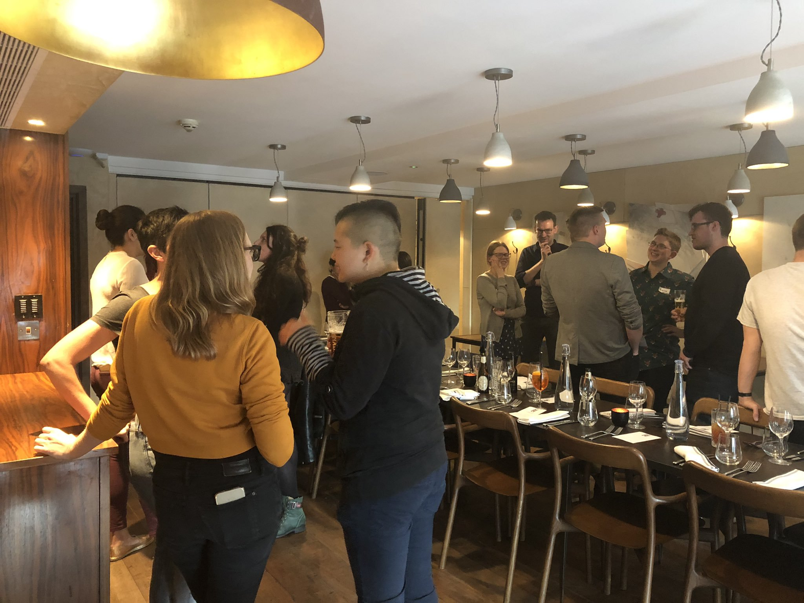
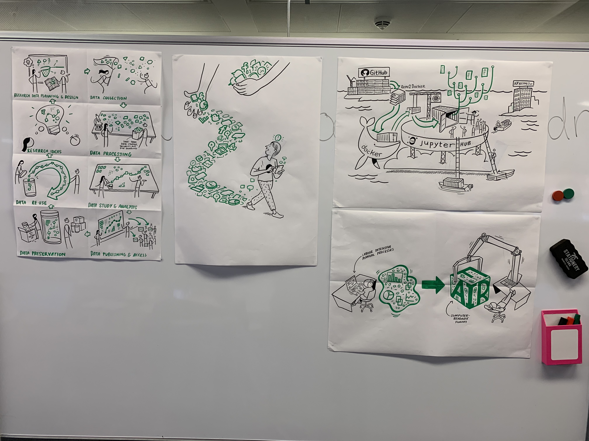
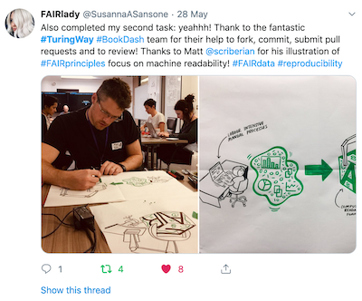
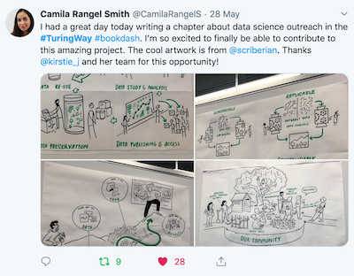
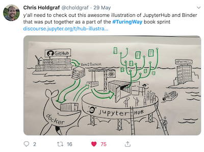
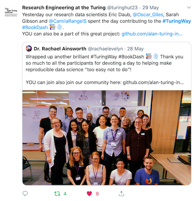

# The Turing Way | Book Dash - London


* Intro to Book Dash MCR slides: https://zenodo.org/record/3233655
* HackMD: http://bit.ly/book-dash-ldn
* Pluses and deltas: https://hackmd.io/qQ8ZjlaYT0qdVIEGzGZjjQ

## The participants


*Back row, left to right: Matthew Kemp, Eric Daub, Michael Grayling, Oscar Giles, Lachlan Mason, Kevin Kunzmann, Nadia Soliman. Middle row, left to right: Kirstie Whitaker, Malvika Sharan, Camila Rangel Smith, Danbee Kim, Rosie Higman, Susanna-Assunta Sansone, Sarah Gibson, Natalei Thurlby. Front row, left to right: Rachael Ainsworth, Patricia Herterich, Cassandra Gould van Praag, Alexander Morley.*

* Rachael Ainsworth [@rainsworth](https://github.com/rainsworth/)
* Eric Daub [@edaub](https://github.com/edaub)
* Sarah Gibson [@sgibson91](https://github.com/sgibson91) 
* Oscar Giles [@OscartGiles](https://github.com/OscartGiles)
* Cassandra Gould van Praag [@cassgvp](https://github.com/cassgvp)
* Michael Grayling [@mjg211](https://github.com/mjg211)
* Patricia Herterich [@pherterich](https://github.com/pherterich)
* Rosie Higman [@rosiehigman](https://github.com/rosiehigman)
* Matthew Kemp [Scriberia](http://www.scriberia.co.uk/)
* Danbee Kim [@taunsquared](https://github.com/taunsquared)
* Kevin Kunzmann [@kkmann](https://github.com/kkmann)
* Eirini Malliaraki [@rockita](https://github.com/rockita)
* Lachlan Mason [@masonlr](https://github.com/masonlr)
* Alexander Morley [@alexmorley](https://github.com/alexmorley)
* Susanna-Assunta Sansone [@SusannaSansone](https://github.com/SusannaSansone) 
* Malvika Sharan [@malvikasharan](https://github.com/malvikasharan)
* Camila Rangel Smith [@crangelsmith](https://github.com/crangelsmith)
* Nadia Soliman [@Nadiasoliman](https://github.com/nadiasoliman)
* Natalei Thurlby [@NatalieThurlby](https://github.com/NatalieThurlby)
* Kirstie Whitaker [@KirstieJane](https://github.com/KirstieJane/)


## Our report

### What did we do?

Our goal for the book dash was to bring together participants enthusiastic about reproducibility to contribute to and improve *The Turing Way* book during a one day collaborative event.
We held a networking event the evening prior to the book dash as a reward and thanks for taking time out to work on the project.
We had an icebreaker for participants to get to know each other and lightning talks where we prompted participants to share unique experiences, expertise or promote any projects that they're working on.
There was a great diversity of lightning talks which were really fun:
* Danbee talked about her science fiction graphic novel that combines her neuroscience PhD research with a speculation on how the next 100 years might play out, given our current intellectual, environmental, and socio-political landscape. Titled *[The First VIRS](http://www.danbeekim.org/VIRS)*, which stands for Vigilante Intergalactic Roustabout Scholar. :art: 
* Sarah brought along some of her cross stitching and discussed how she uses it as a form of self care as she finds it hard to switch off sometimes. She likes that it's methodical work like an ink jet printer, a “glorified form of pixel art”, and that it can get really sassy: “[I’ve got 99 problems but a stitch ain’t one](https://www.goodreads.com/book/show/31947717-i-got-99-problems-but-a-stitch-ain-t-one)”. :tipping_hand_woman: 
* Cassandra told us about her past, present, future. During her PhD, she would swear at her computer because her analysis killed the machine. Colleagues asked her, why aren’t you using High Performance Computing (HPC)? The switch transformed the work she did then and now. She now wants to bring [research software engineering (RSE)](https://researchsoftware.org/) support to everyone. She's applying for funding for 3 postdocs on a fractional basis to establish an RSE department. She wants to know: what kind of work can this newly developed group do to establish themselves? How are we going to measure the success? :woman_technologist:
* Eric revealed that his motivation for contributing to *The Turing Way* was because he spent his PhD simulating earthquakes, running around the beach, brewing beer and cooking in Santa Barbara, but he could more easily reproduce the food and beer he made than any of the science he did. :beers:
* Natalie described the [MAPS](https://jean-golding-institute.github.io/maps/) project: mapping the analytical paths of a crowdsourced data analysis. She wants to know if different types of scientists, researchers and data scientists make different analysis decisions and the goal of this project is to see the variety of different things that can happen and run a data visualisation competition. :world_map:
* Malvika discussed her experience as a community manager in bioinformatics and biology, and that she tries to trick people into thinking open science is great - you won’t need a great reference from a supervisor because everything will be visible! :eyes: 
* Nadia pitcher her citizen science project of 150 scientists over 32 countries, a [systematic review of cannibis models in animals in pain](https://form.jotform.com/90514957489169). There are 10,000+ studies to screen and they are recruiting contributors (who can win an iPad!) to prove that crowd/community/citizen science is actually a feasible thing to do. Her question was, “How to create community to keep people engaged and working on project?” :monkey_face:
* Alex began his talk with, “I always know that my partner is right!” He took a human centred design course, promoting the idea of how to research what you want to build and create things based on what people need which is now really important to how he works now. It involves watching what people are doing, asking what pain points are. He applies this now in the context of open source software and looking to explore user centred design. :man_technologist:



*Networking dinner at Merago hotel.*

During the dash, we set out to build upon the [Manchester Book Dash](book-dash-mcr-report.md) experience: we wanted to enhance the first version of *The Turing Way* book and ensure that contributing to the project is as straightforward as possible.
We had a mixture of contributions including curating and editing existing content, expanding existing content and writing entirely new content.
Specifically:
* 56 new [issues and pull requests](https://github.com/alan-turing-institute/the-turing-way/labels/book-dash-ldn)! (29 issues, 26 pull requests tagged with ```book-dash-ldn```)
* Many of the pull requests have been reviewed, approved and published already, and issues closed!
* Proofreading and editing of existing chapters.
* Further information added to existing chapters.
  * Updated the Reproducibility Chapter with new sections ([Issue #596](https://github.com/alan-turing-institute/the-turing-way/issues/596), [Pull request #612](https://github.com/alan-turing-institute/the-turing-way/pull/612))
  * Added Singularity section to Reproducible Environments chapter ([Issue #607](https://github.com/alan-turing-institute/the-turing-way/issues/607), [Pull request #608](https://github.com/alan-turing-institute/the-turing-way/pull/608))
  * Extended section on FAIR and included personal journey to FAIR ([Issue #555](https://github.com/alan-turing-institute/the-turing-way/issues/555), [Issue #586](https://github.com/alan-turing-institute/the-turing-way/issues/586), [Pull request #568](https://github.com/alan-turing-institute/the-turing-way/pull/568))
* New chapters on:
  * BinderHub ([Issue #426](https://github.com/alan-turing-institute/the-turing-way/issues/426), [Pull request #557](https://github.com/alan-turing-institute/the-turing-way/pull/557))
  * Ethical Decision Making ([Issue #552](https://github.com/alan-turing-institute/the-turing-way/issues/552))
     * Sub-chapter on Research Planning ([Pull request #610](https://github.com/alan-turing-institute/the-turing-way/pull/610))
  * Outreach and Communicating Results to Others ([Issue #553](https://github.com/alan-turing-institute/the-turing-way/issues/553), [Pull request #561](https://github.com/alan-turing-institute/the-turing-way/pull/561))
  * Very Large Datasets (and high-level intro to data provenance) ([Issue #558](https://github.com/alan-turing-institute/the-turing-way/issues/558), [Pull request #585](https://github.com/alan-turing-institute/the-turing-way/pull/585))
  * Glossary ([Issue #598](https://github.com/alan-turing-institute/the-turing-way/issues/598))
  * IDEs, Editors, and Notebooks ([Issue #617](https://github.com/alan-turing-institute/the-turing-way/issues/617), [Pull request #619](https://github.com/alan-turing-institute/the-turing-way/pull/619)
* Reviewed pull requests.
* Restructuring of the chapter sections.
* A Docker compose file to be able to host the build locally ([Issue #590](https://github.com/alan-turing-institute/the-turing-way/issues/590), [Pull request #592](https://github.com/alan-turing-institute/the-turing-way/pull/592))
* A [Hackathon Contribution Live Tracker](https://alexmorley-watch-turing-way.glitch.me)! ([Issue #595](https://github.com/alan-turing-institute/the-turing-way/issues/595))
* Collected "Reproducibility Challenges" in the [HackMD](http://bit.ly/book-dash-ldn)
* Improved the ease of contributing to the project through updating contributing guidelines, README, organisation of the repo, referencing ([issues/519](https://github.com/alan-turing-institute/the-turing-way/issues/519)), Governance section ([Pull request #384](https://github.com/alan-turing-institute/the-turing-way/pull/384)), standardising tasks and continuous integration updates within the project.
* Got the Turing Way repo onto Zenodo with versioned DOIs after lots of time thinking about authorship and credit guidelines: https://zenodo.org/record/3233986
* Acknowledged contributors! :tada:
* Gorgeous graphics! :heart_eyes:


*Art by Matthew Kemp of [Scriberia](http://www.scriberia.co.uk/).*


## What did we learn?

* 2 first pull requests!! :bell: :bell:
* Two underscores in file names break Travis/something with the CI and prevent you merging.
* Learned how to make a pull request, discovered an online resource for hosting large datasets (Dataverse).
* How to use travis for continuous integration and how to use GitHub better for doing a big collaborative project.
* Create a `book-dash` branch that people can merge their PRs into. This could skip the requirement for CI in the short term, and then we could merge that branch to master at the end of the day.
  * So a suggested work flow could be:
    * Fork and make changes
    * Open PR to `book-dash` branch
    * Review (interate)
    * Approve (no CI needed)
  * At the end of the day, merge the `book-dash` branch to master if all tests pass.
* Emphasise style guide in introduction in addition to all the available templates (issue, PR, chapter).

## Feedback

At the end of the event, we asked participants to tell us anonymously something that they liked about the book dash and something they would change in an exercise called Pluses and Deltas which were recorded in [this HackMD](https://hackmd.io/9IIQpagHQoOGlwUnY98xQA).
The main pluses included that the book dash was a really supportive and inclusive environment, was well-organised, that the icebreaker was brilliant, a great mix of people were involved with different expertise and that the participants really enjoyed having the artist in residence from [Scriberia](http://www.scriberia.co.uk/)!
Some aspects of the book dash that the participants would change would be to include a friendlier introduction to Git/GitHub, more guidance on what tasks to take up and more time!

## Impact

Many participants tweeted using [#TuringWay](https://twitter.com/hashtag/TuringWay)!


  

  

  


